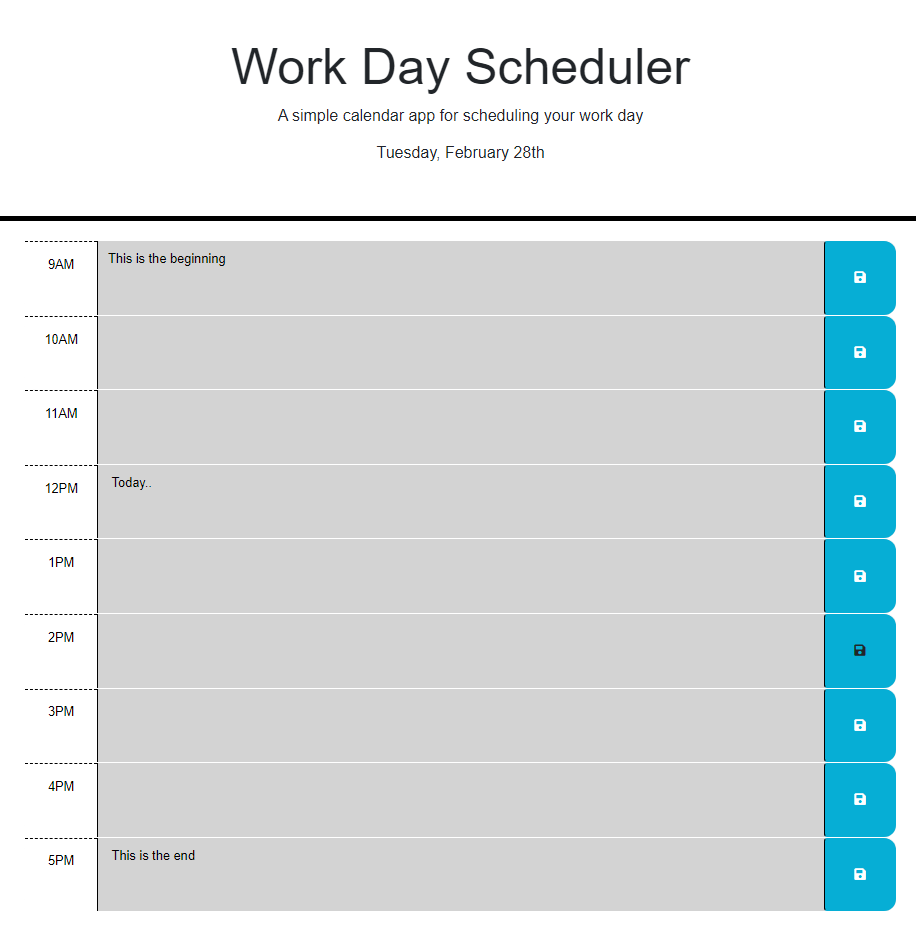

# Work Day Scheduler

This is a website that allows you to schedule your work day.

## Description

This webpage utilizes jQuery and dayjs to create a scheduler based on the current time. Each hour block takes in written input by the user and stores it locally. The hour block color schemes update to reflect the current hour, and the date is updated to reflect the current date.

## Deployment

Website: [Work Day Website](https://corbinspence.github.io/Work-Day-Scheduler/)

## Screenshot

## Author

Corbin Spence

## Source Code

[Origin](https://github.com/coding-boot-camp/crispy-octo-meme)